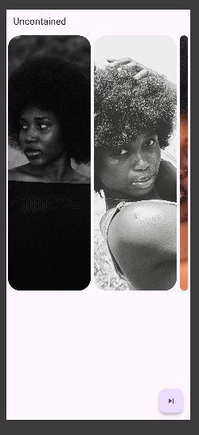
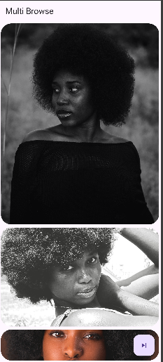
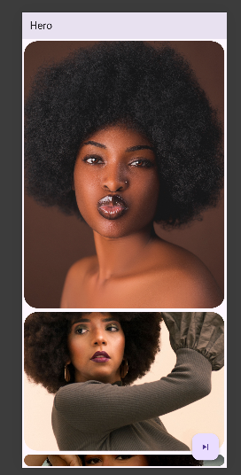
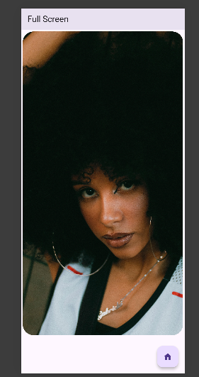

# Widget Presentation

A Flutter app that shows the `CarouselView` widget, a gallery of pictures you can slide through, in four different styles.

## Screenshots

| Uncontained | Multi Browse | Hero | Full Screen |
|:---:|:---:|:---:|:---:|
|  |  |  |  |

## How to run

1. Install [Flutter](https://docs.flutter.dev/get-started/install).
2. Open this folder in a terminal.
3. Download the packages the app needs:
   ```
   flutter pub get
   ```
4. Start the app on a phone, emulator, or browser:
   ```
   flutter run
   ```

Tap the button at the bottom right to move to the next page. On the last page, the home button takes you back to the start.

## The three main attributes

These are the settings on `CarouselView` that change how the gallery looks and behaves:

- **`scrollDirection`**: which way the pictures slide. Sideways is the default. `Axis.vertical` makes them slide up and down.
- **`flexWeights`** (used with `CarouselView.weighted`): how much room each visible picture gets. For example, `[6, 3, 1]` shows one big, one medium and one small picture.
- **`itemSnapping`**: when `true`, the gallery settles neatly on one picture after you let go. When `false`, it glides freely.

## The four pages

| Page | What you see |
|------|--------------|
| Uncontained | Pictures slide sideways in a row, all the same size |
| Multi Browse | Pictures slide up and down: one big, one medium, one small |
| Hero | Pictures slide up and down: one big and one smaller |
| Full Screen | One picture fills the screen at a time |

## Project layout

- `lib/main.dart`: starts the app and lists its pages
- `lib/images.dart`: the list of pictures used by every page
- `lib/screens/`: one file for each page
- `images/`: the picture files
- `screenshots/`: the pictures used in this README
